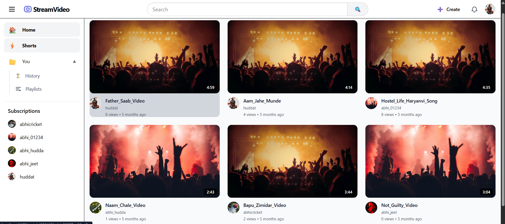
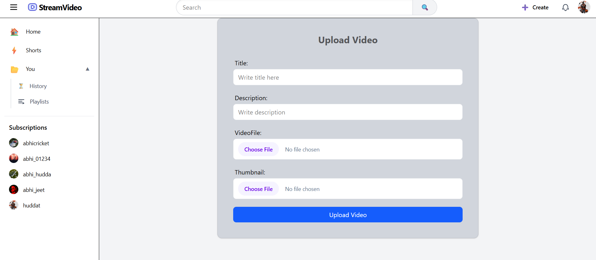
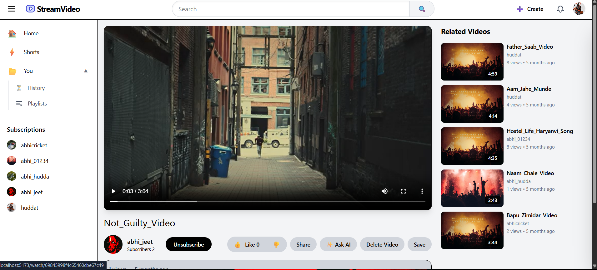
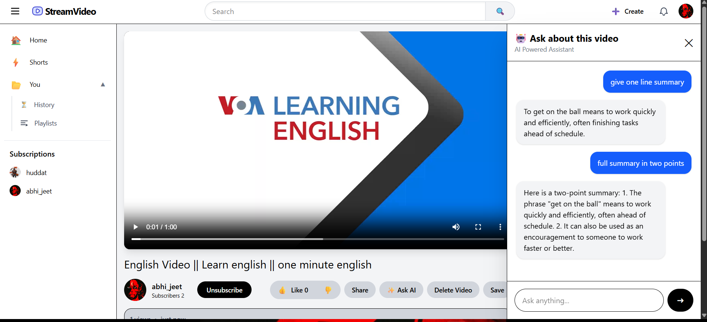

# AI Powered Video Stream

AI Powered Video Stream is a full-stack video platform with authentication, video uploads, playlists, subscriptions, comments, likes, notifications, semantic search, and an AI question-and-answer experience for processed videos.

## Screenshots

<p align="center">
  
  
</p>
<p align="center">
  
  
</p>

## Architecture

| Service | Directory | Technology | Default local address |
| --- | --- | --- | --- |
| Web client | `01frontend` | React, Vite, Tailwind CSS, Redux Toolkit, React Query | `http://localhost:5173` |
| API server | `01Backend` | Express, MongoDB, Socket.IO, Cloudinary, Pinecone | `http://localhost:8000` |
| AI service | `01AI_Services` | FastAPI, Faster Whisper, LangChain, Pinecone | `http://127.0.0.1:8001` |

The Vite development server proxies `/api` requests to the API server. The API server calls the AI service after a video upload and when a user asks a question about a processed video.

## Prerequisites

- Node.js 20 or later and npm
- Python 3.11 or later
- MongoDB instance
- Cloudinary account
- Pinecone API key and indexes
- Hugging Face token for downloading models, if required

The AI service downloads embedding and Whisper models on first use. Ensure the machine can reach Hugging Face and has sufficient disk space and memory.

## Setup

Clone the repository and install dependencies for each service.

```powershell
cd 01Backend
npm ci

cd ..\01frontend
npm ci

cd ..\01AI_Services
python -m venv .venv
.\.venv\Scripts\Activate.ps1
pip install -r requirements.txt
```

### Environment variables

Create the following local files. Do not commit real secrets.

`01Backend/.env`

```env
PORT=8000
MONGODB_URI=mongodb+srv://<user>:<password>@<cluster>
CORS_ORIGIN=http://localhost:5173
ACCESS_TOKEN_SECRET=<secure-random-value>
ACCESS_TOKEN_EXPIRY=1d
REFRESH_TOKEN_SECRET=<secure-random-value>
REFRESH_TOKEN_EXPIRY=10d
CLOUDINARY_CLOUD_NAME=<cloud-name>
CLOUDINARY_API_KEY=<api-key>
CLOUDINARY_API_SECRET=<api-secret>
PINECONE_API_KEY=<pinecone-api-key>
PINECONE_INDEX=<video-search-index>
AI_SERVICE_URL=http://127.0.0.1:8001
```

`01AI_Services/.env`

```env
HOST=127.0.0.1
PORT=8001
DEBUG=true
EMBEDDING_MODEL=BAAI/bge-small-en-v1.5
PINECONE_API_KEY=<pinecone-api-key>
PINECONE_INDEX=<ai-transcript-index>
PINECONE_CLOUD=<cloud-provider>
PINECONE_REGION=<region>
WHISPER_MODEL=base
WHISPER_DEVICE=cpu
WHISPER_COMPUTE_TYPE=int8
HF_TOKEN=<hugging-face-token>
LLM_MODEL=<configured-llm-model>
```

`LLM_MODEL` is required by the AI service configuration. `CHAT_MODEL` is not read by the current code.

## Run locally

Open three terminals and start the services in this order:

```powershell
# Terminal 1: AI service
cd 01AI_Services
.\.venv\Scripts\Activate.ps1
uvicorn main:app --reload --host 127.0.0.1 --port 8001
```

```powershell
# Terminal 2: API server
cd 01Backend
npm run dev
```

```powershell
# Terminal 3: web client
cd 01frontend
npm run dev
```

Open the client URL printed by Vite, usually `http://localhost:5173`.

## Key endpoints

All API-server video routes require authentication.

| Method | Endpoint | Purpose |
| --- | --- | --- |
| `POST` | `/api/v1/videos/publish` | Upload a video and thumbnail |
| `GET` | `/api/v1/videos` | List videos with pagination and filters |
| `GET` | `/api/v1/videos/semantic-search?query=<text>` | Search videos by semantic similarity |
| `POST` | `/api/v1/videos/:videoId/process-ai` | Process a video for AI questions |
| `POST` | `/api/v1/videos/:videoId/ask` | Ask a question about a processed video |

The AI service also exposes `GET /health`, `POST /process-video/`, `POST /ask`, `POST /embedding/`, `POST /transcript/`, and `DELETE /delete-video/:video_id`. Its interactive documentation is available at `http://127.0.0.1:8001/docs` while it is running.

## Available commands

| Directory | Command | Description |
| --- | --- | --- |
| `01Backend` | `npm run dev` | Start the Express API with Nodemon |
| `01frontend` | `npm run dev` | Start the Vite development server |
| `01frontend` | `npm run build` | Create a production client build |
| `01frontend` | `npm run lint` | Run ESLint |
| `01AI_Services` | `uvicorn main:app --reload --port 8001` | Start the FastAPI service |

## Project structure

```text
01frontend/       React client and UI state
01Backend/        Express API, MongoDB models, Socket.IO, upload handling
01AI_Services/    FastAPI RAG pipeline, transcription, and vector storage
README.md         Project setup and operating guide
```
